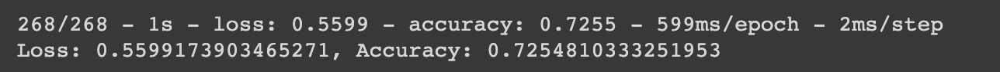
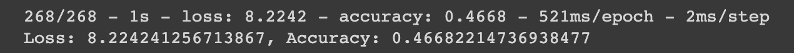
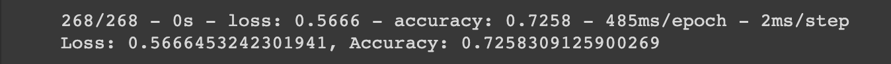
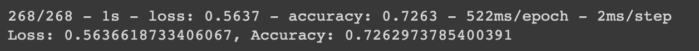

# deep-learning-challenge

For this part of the assignment, you’ll write a report on the performance of the deep learning model you created for Alphabet Soup.

The report should contain the following:
**Overview of the analysis: Explain the purpose of this analysis.**
-  Analyzing the performance of the deep learning model created for Alphabet Soup. The goal is to create a model with high accuracy!

Results: Using bulleted lists and images to support your answers, address the following questions:

## Data Preprocessing
**1. What variable(s) are the target(s) for your model?**
- For the model, we are targeting the variables: CLASSIFICATION & APPLICATION_TYPE

**2. What variable(s) are the features for your model?**
- For the model, the variable(s) for the features of the model could be the INCOME_AMT or ASK_AMT!

**3. What variable(s) should be removed from the input data because they are neither targets nor features?**
- Dropped the EIN and NAME columns, as these columns are not considered as either the target or feature variables.

## Compiling, Training, and Evaluating the Model

**4. How many neurons, layers, and activation functions did you select for your neural network model, and why?**
- Originally, the two-hidden-layer model had a neuron number of units of 80 with activation of sigmoid for layer 1 and 20 units for layer 2 and an activation of relu. Plus, an output layer with a neuron unit 20 with a linear activation. This led to a total of 5,161 params and a loss rate of 56.0%, and an accuracy rate of 72.5%.

**5. Were you able to achieve the target model performance?**
- The goal for the target model performance was between 70% to 90%, with a specific percentage of 80% (the middle).

**6. What steps did you take in your attempts to increase model performance?**
- Optimization 1: Adding another hidden layer with a "swish" activation & a neuron unit of 20. Unfortunately, that led to a loss rate of 822.4% and an accuracy rate of 46.7%.

- Optimization 2: Adjust the number of neurons with the two-hidden-layer model. Changing layer 1 to a neuron unit of 90 & layer 2 to a neuron unit of 40. Checking the param of the model, it increased the total param amount to 7,641. These changes led to a loss rate of 56.6% and an accuracy rate of 72.6%.

- Optimization 3: Added a "relu" third hidden layer with a neuron unit of 5, Thee results were a loss rate of 56.3% and an accuracy rate of 72.6%.

